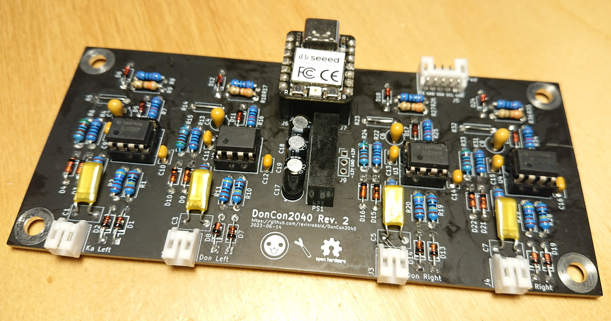

# DonConIO - Signal Conditioning for the DonCon2040

This board hosts a Seeed Studio XIAO RP2040 microcontroller unit and provides signal conditioning for the piezo drum triggers. The conditioning circuit is reverse engineered from the *V260 SIF PCB* found in the original arcades. This is also the main reason why this board uses mainly through hole parts ... for *authenticity*.

## Sensors

The arcade drum uses *Sensatec GSS-4SD* piezo impact sensors. While those are only available as expensive arcade spare parts, the *GSS-4SA* and *GSS-4SC* variants used in this build can be readily ordered directly from the manufacturer. My guess here is that the *D* variant only uses a different cable and connector, but who knows ...

You can also try your luck with any generic piezo, in this case you might have to tune the filters and amplification factor.

## Note

This board does not use the internal ADCs of the RP2040 since those are pretty noisy and have a static offset of around +25mV. You can however still skip the external ADC and level-shifter and connect the signals directly to ADC pins of the XIAO RP2040 if you want to save some cost.

## Bill of Materials

| **Reference**                                         |                   **Description**                    |     **Digikey Part**      |                                         **Notes**                                         |
| ----------------------------------------------------- | :--------------------------------------------------: | :-----------------------: | :---------------------------------------------------------------------------------------: |
| J6, J7                                                |               Seeed Studio XIAO RP2040               |             -             |                                                                                           |
| U1, U2, U3, U4                                        |                  TL072CP JFET OpAmp                  |       296-1775-5-ND       |                                                                                           |
| U5                                                    |                MCP3204 12bit SPI ADC                 |     MCP3204-CI/SL-ND      |                                                                                           |
| U6                                                    |           MCP1541 4.09V Voltage Reference            |    MCP1541T-I/TTCT-ND     |                                                                                           |
| U7                                                    | TXB0104 4-Bit Bidirectional Voltage-Level Translator |      296-21928-1-ND       |                                                                                           |
| PS1                                                   |              +/-12V DC to DC Converter               |    2725-A0512S-1WR3-ND    |                                                                                           |
| C1, C3, C5, C7                                        |            1nF Mylar/Polyester Capacitor             |       493-14299-ND        |                                                                                           |
| C2, C4, C6, C8                                        |              0.47µF Tantalum Capacitor               |        478-1901-ND        |                                                                                           |
| C9-C16                                                |               100nF Ceramic Capacitor                |        BC1084CT-ND        |                                                                                           |
| C17                                                   |             4.7µF Electrolytic Capacitor             |       1189-1421-ND        |                                                                                           |
| C18, C19                                              |              1µF Electrolytic Capacitor              |     50YXJ4.7M5X11-ND      |                                                                                           |
| C20, C22, C24, C25                                    |             0.1µF SMD Ceramic Capacitor              |      1276-1003-1-ND       |                                                                                           |
| C21, C23, C26                                         |              10µF SMD Ceramic Capacitor              |      1276-6454-1-ND       |                                                                                           |
| D1, D2, D5, D7, D8, D11, D13, D14, D17, D19, D20, D23 |              1SS133M Small Signal Diode              |      1SS133MR0GCT-ND      | While the 1SS133M is probably more *authentic*, a 1N4148 will probably just work as well. |
| D3, D4, D9, D10, D15, D16, D21, D22                   |                 BAT43 Schottky Diode                 |    112-BAT43-TAPCT-ND     |                                                                                           |
| D6, D12, D18, D24                                     |            1N5229B 4.3V 500mW Zener Diode            |      1N5229BFSCT-ND       |                                                                                           |
| R1, R10, R19, R28                                     |                     1MΩ Resistor                     |  13-MFR-25FTE52-1MCT-ND   |                                                                                           |
| R2, R11, R20, R29                                     |                    4.7kΩ Resistor                    |  13-MFR-25FRF52-4K7CT-ND  |                                                                                           |
| R3, R12, R21, R30                                     |                    100kΩ Resistor                    | 13-MFR-25FRF52-100KCT-ND  |                                                                                           |
| R4, R13, R22, R31                                     |                    100Ω Resistor                     | 13-MFR-25FRF52-100RCT-ND  |                                                                                           |
| R6, R15, R24, R33                                     |                    5.1kΩ Resistor                    |  13-MFR-25FRF52-5K1CT-ND  |                                                                                           |
| R7, R16, R25, R34                                     |                    10kΩ Resistor                     |  13-MFR-25FRF52-10KCT-ND  |
| R8, R17, R26, R35                                     |                     1kΩ Resistor                     |  13-MFR-25FRF52-1KCT-ND   |
| R9, R18, R27, R36                                     |                    300Ω Resistor                     |     MFR-25FRF52-300R      |
| R37                                                   |                  10kΩ SMD Resistor                   | 2019-RK73H2ATTD1002FCT-ND |                                                                                           |
| J1, J2, J3, J4                                        |              2Pin S2B-PH-K-S Connector               |        455-1719-ND        |                       PHR-2 plus SPH-002T-P0.5L is the counterpart                        |
| J5                                                    |              5Pin S5B-PH-K-S Connector               |        455-1722-ND        |                       PHR-5 plus SPH-002T-P0.5L is the counterpart                        |
