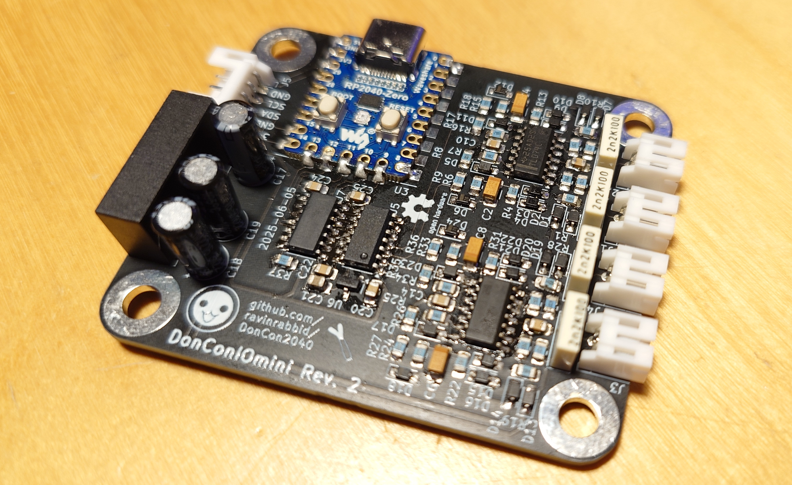

# DonConIOmini - Signal Conditioning for the DonCon2040

This board hosts a Waveshare RP2040-Zero microcontroller unit and provides signal conditioning for the piezo drum triggers. The conditioning circuit is reverse engineered from the *V260 SIF PCB* found in the original arcades. In contrast to the original [DonConIO](/pcb/DonConIO) this board uses mainly SMD parts... less authentic but way better noise characteristics.

## Sensors

The arcade drum uses *Sensatec GSS-4SD* piezo impact sensors. While those are only available as expensive arcade spare parts, the *GSS-4SA* and *GSS-4SC* variants used in this build can be readily ordered directly from the manufacturer. My guess here is that the *D* variant only uses a different cable and connector, but who knows ...

You can also try your luck with any generic piezo, in this case you might have to tune the filters and amplification factor.

## Notes

- If the sensitivity for a pad feels to low you can try to increase the feedback resistor (R3,R13,R21,R30) of the affected pad for more amplification.
- You might also get better sensitivity using larger (2.2nF) capacitors for C1,C3,C5 and C7 depending on your drum construction.
- This board does not use the internal ADCs of the RP2040 since those are pretty noisy and have a static offset of around +25mV. You can however still skip the external ADC and level-shifter and connect the signals directly to ADC pins of the RP2040-Zero if you want to save some cost.

## Bill of Materials

| **Reference**                                         |                   **Description**                    |     **Digikey Part**      |                  **Notes**                   |
| ----------------------------------------------------- | :--------------------------------------------------: | :-----------------------: | :------------------------------------------: |
| U3                                                    |                Waveshare RP2040-Zero                 |             -             |                                              |
| U1, U2                                                |                 TL072CDR JFET OpAmp                  |       296-1283-1-ND       |                                              |
| U5                                                    |                MCP3204 12bit SPI ADC                 |     MCP3204-CI/SL-ND      |                                              |
| U6                                                    |           MCP1541 4.09V Voltage Reference            |    MCP1541T-I/TTCT-ND     |                                              |
| U7                                                    | TXB0104 4-Bit Bidirectional Voltage-Level Translator |      296-21928-1-ND       |                                              |
| PS1                                                   |              +/-12V DC to DC Converter               |        811-3205-ND        |                                              |
| C1, C3, C5, C7                                        |                  1nF Film Capacitor                  |       399-11751-ND        |                                              |
| C2, C4, C6, C8                                        |            0.47µF SMD Tantalum Capacitor             |       399-8287-1-ND       |                                              |
| C9-C16, C20, C22, C24, C25                            |             0.1µF SMD Ceramic Capacitor              |      1276-1003-1-ND       |                                              |
| C17                                                   |             4.7µF Electrolytic Capacitor             |       1189-1421-ND        |                                              |
| C18, C19                                              |              1µF Electrolytic Capacitor              |     50YXJ4.7M5X11-ND      |                                              |
| C21, C23, C26                                         |              10µF SMD Ceramic Capacitor              |      1276-6454-1-ND       |                                              |
| D1, D2, D5, D7, D8, D11, D13, D14, D17, D19, D20, D23 |                  1N4148WS SMD Diode                  |     1N4148WS-FDICT-ND     |                                              |
| D3, D4, D9, D10, D15, D16, D21, D22                   |               BAT43 SMD Schottky Diode               |  112-BAT43WS-E3-08CT-ND   |        1N4148 will probably work too         |
| D6, D12, D18, D24                                     |              4.3V 400mW SMD Zener Diode              |    1727-PDZ4.3BZCT-ND     |                                              |
| R1, R10, R19, R28                                     |                   1MΩ SMD Resistor                   | 2019-RK73H2ATTD1004FCT-ND |                                              |
| R2, R11, R20, R29                                     |                  4.7kΩ SMD Resistor                  | 2019-RK73H2ATTD4701FCT-ND |                                              |
| R3, R12, R21, R30                                     |                  100kΩ SMD Resistor                  | 2019-RK73H2ATTD1003FCT-ND |                                              |
| R4, R13, R22, R31                                     |                  100Ω SMD Resistor                   | 2019-RK73H2ATTD1000FCT-ND |                                              |
| R6, R15, R24, R33                                     |                  5.1kΩ SMD Resistor                  | 2019-RK73H2ATTD5101FCT-ND |                                              |
| R7, R16, R25, R34, R37                                |                  10kΩ SMD Resistor                   | 2019-RK73H2ATTD1002FCT-ND |                                              |
| R8, R17, R26, R35                                     |                   1kΩ SMD Resistor                   | 2019-RK73H2ATTD1001FCT-ND |                                              |
| R9, R18, R27, R36                                     |                  300Ω SMD Resistor                   | 2019-RK73H2ATTD3000FCT-ND |                                              |
| J1, J2, J3, J4                                        |              2Pin S2B-PH-K-S Connector               |        455-1719-ND        | PHR-2 plus SPH-002T-P0.5L is the counterpart |
| J5                                                    |              5Pin S5B-PH-K-S Connector               |        455-1722-ND        | PHR-5 plus SPH-002T-P0.5L is the counterpart |
