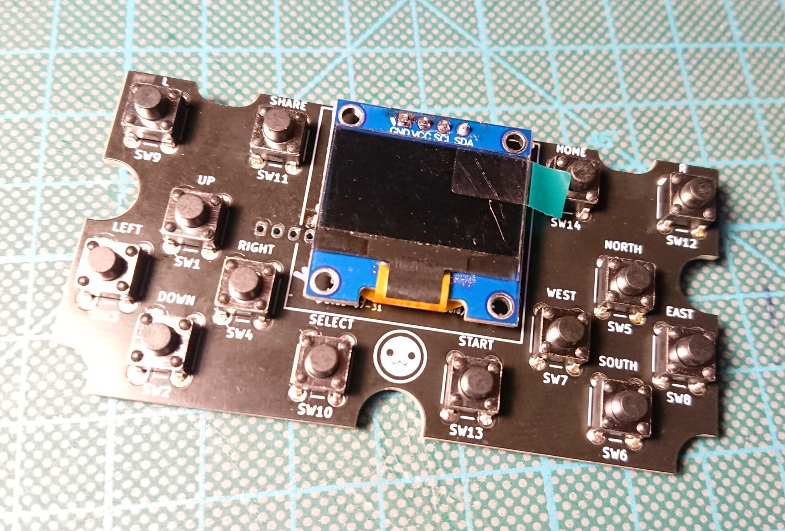

# DonConPad - A Simple I2C Gamepad with Display

This board breaks out an MCP23017 I/O expander to some conveniently placed push buttons and offers a spot for an SSD1306 OLED display.
Both I/O expander and display are connected to the same i2c bus.

The i2c address for the MCP23017 can be configured using the jumpers JP1, JP2 and JP3, which are pulled down to GND when open.

## Case

A 3D-printable case can be found in the [case subdirectory](./Case/). Print the `Top`, the `Bottom` and 14 `Buttons`. Insert 6mm diameter M4 heat set inserts into the top part and screw together using M4 screws.  

## Bill of Materials

| **Reference**          |       **Description**       |       **Digikey Part**       |                                 **Notes**                                 |
| ---------------------- | :-------------------------: | :--------------------------: | :-----------------------------------------------------------------------: |
| J1                     | SSD1306 OLED Display Module |              -               | Dimension wise 128x64 or 128x32 should fit. Make sure the pinout matches. |
| U1                     |    MCP23017 IO Expander     |       MCP23017-E/SO-ND       |                                                                           |
| SW1-14                 |    6x6mm Tactile Switch     | e.g. TS02-66-60-BK-100-LCR-D |                                                                           |
| C1                     | 0.1µF SMD Ceramic Capacitor |        1276-1003-1-ND        |                                                                           |
| C2                     | 10µF SMD Ceramic Capacitor  |        1276-6454-1-ND        |                                                                           |
| R1, R2, R3, R4, R5, R6 |      10kΩ SMD Resistor      |  2019-RK73H2ATTD1002FCT-ND   |                                                                           |
